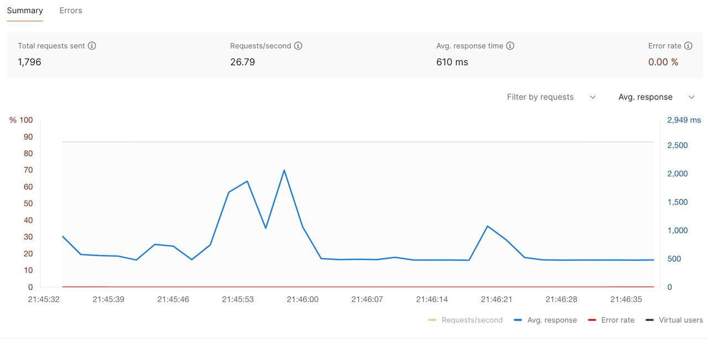
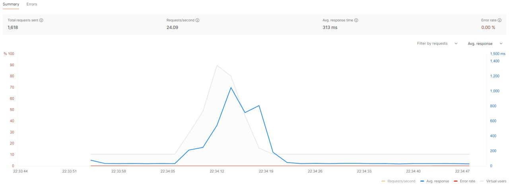

# Верендеев Роман Б21-525
## Пятая лаборатнорная работа по дисциплине "Практические аспекты разработки высокопроизводительного программного обеспечения"

### Карточка сервиса

Сервис предоставляет услуги салона красоты и парикмахерской с возможностью онлайн записи на приемы.
Используемые технологии включают SQLite для хранения данных, Redis для управления очередями запросов и обработки результатов.

Основные функции включают онлайн запись, информацию об услугах, профили клиентов, управление расписанием, отзывы и рейтинги, уведомления и покупку товаров салона через интернет-магазин.

База данных хранит информацию о клиентах, записях на приемы, доступных услугах салона, а также товарах для продажи. Средний поток пользователей составляет примерно 50-100 пользователей в час в обычные дни, а пиковый поток - до 100-150 пользователей в час в периоды повышенного спроса.

Выбор Redis обусловлен простотой интерфейса, надежностью и соответствием требованиям проекта.

В качестве API-сервиса был выбран Flask.

Основной причиной является небольшой размер нагрузки, в связи с расположением салона красоты в небольшом городе и отсутвием потребности масштабируемости проекта в будущем.

### Результат

В ходе лабораторной работы было добавлено кеширование на примере метода загрузки главной страницы и были сравнены два основных показателя загрузки - время и размер кэша.
Это было сделано с целью оценивания насколько использования кеширования будет полезнее по времени, сравнивая с результатами третьей лабораторной работы.

В лабораторной работе используется система кеширования Flask_caching.

Также, аналогично 3 лабораторной работе проведено нагрузочное тестирование 

Видно, что показатели времени меньше чем без использования кеширования

Средние показатели времени без кеширования: 0.058541 seconds

Средние показатели времени с использованием кеширования: 0.038541 seconds

Кеширование - очень полезная и важная функция в жизни каждого приложения