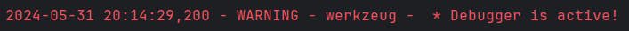

# Верендеев Роман Б21-525
## Третья Лаборатнорная работа по дисциплине "Практические аспекты разработки высокопроизводительного программного обеспечения"

### Карточка сервиса

Сервис предоставляет услуги салона красоты и парикмахерской с возможностью онлайн записи на приемы.
Используемые технологии включают SQLite для хранения данных, Redis для управления очередями запросов и обработки результатов.

Основные функции включают онлайн запись, информацию об услугах, профили клиентов, управление расписанием, отзывы и рейтинги, уведомления и покупку товаров салона через интернет-магазин.

База данных хранит информацию о клиентах, записях на приемы, доступных услугах салона, а также товарах для продажи. Средний поток пользователей составляет примерно 50-100 пользователей в час в обычные дни, а пиковый поток - до 100-150 пользователей в час в периоды повышенного спроса.

Выбор Redis обусловлен простотой интерфейса, надежностью и соответствием требованиям проекта.

В качестве API-сервиса был выбран Flask.

Основной причиной является небольшой размер нагрузки, в связи с расположением салона красоты в небольшом городе и отсутвием потребности масштабируемости проекта в будущем.

### Результат

С помощью инстумента Postman было проведено нагрузочное тестирование, рассматривая увеличение и уменьшения числа пользователей от 0 до 100 в пике в течение 6 минут.

Анализируя график можно увидеть линейное увеличение и уменьшение времени ответа, что соотвествует норме.

